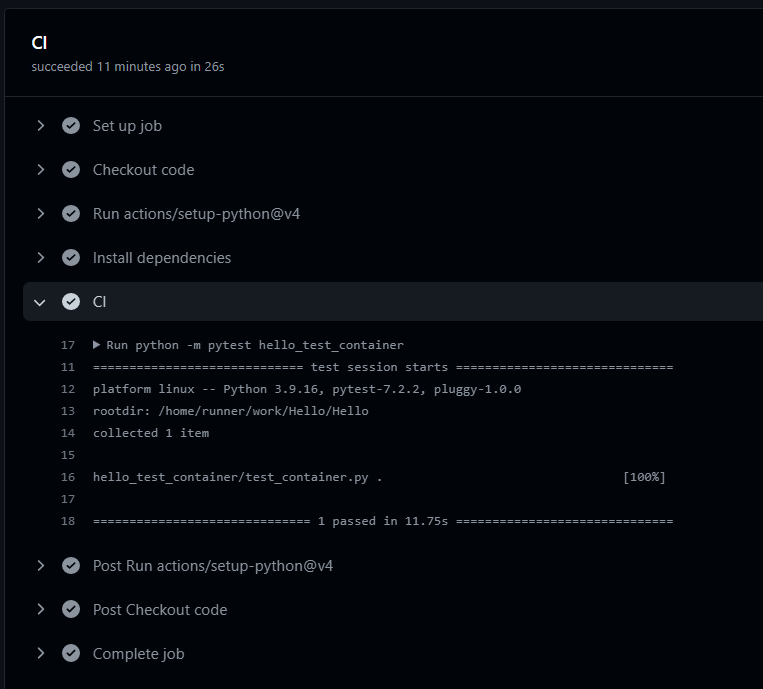

# Test Container(Python + SqlAlchemy + Postgres)

## 遇到的問題
當我們使用TDD的方式來開發時，時常會把資料庫相關的地方都直接Mock掉，來假設跟DB之間的交流是符合邏輯的。但往往會發生不如預期的事情，假如某張table要增加一個欄位，但某些地方卻沒修改到，導致服務整個爆炸，就GG了

## 解決方式
因為會有上面的問題，所以就有了`Test Container`，來支援撰寫測試案例的時候，可以幫忙起個容器(Container)，並架設指定的資料庫(Postgres、MySQL...)等等可以放在Docker上面的images都能進行設定

## 實作分享
1. 安裝套件
```
pip install testcontainers==3.4.2
pip install SQLAlchemy==1.4.45
pip install psycopg2-binary==2.9
pip install pytest==7.2.2
```

2. 定義DB table
- 我們透過sqlalchemy這個ORM的框架來定義DB的table
```python
from sqlalchemy import Column, String
from sqlalchemy.orm import declarative_base
Base = declarative_base()

class User(Base):
    __tablename__ = "users"

    uid = Column(String(100), primary_key=True, unique=True, index=True)
    name = Column(String(100))
    picture = Column(String(255))

    def __str__(self):
        return f"User uid: {self.uid}, name: {self.name}, picture: {self.picture}"
```

3. 定義SQL create方法
```python
def create_user(db, user: User):
    db_user = User(uid=user.uid, name=user.name, picture=user.picture)
    db.add(db_user)
    db.commit()
    return db_user
```

4. 定義測試DB container
- 撰寫成decorator的形式用來方便套用在測試案例上面，並藉此來控制`db.close()`操作
```python
from functools import wraps

import sqlalchemy
from sqlalchemy.orm import sessionmaker
from testcontainers.postgres import PostgresContainer

def db_mask(func):
    @wraps(func)
    def wrapper(*args):
        # postgres:9.5 支援各種docker內的postgres版本
        with PostgresContainer("postgres:9.5") as postgres:
            engine = sqlalchemy.create_engine(postgres.get_connection_url())
            session_local = sessionmaker(autocommit=False, autoflush=False, bind=engine)
            Base.metadata.create_all(bind=engine)  # 創建User test table

            db = session_local()
            try:
                func(db=db, *args)
            finally:
                db.close()
    return wrapper
```

5. 撰寫測試方式
```python
import unittest

class TestUserCRUD(unittest.TestCase):
    @db_mask
    def test_create_user(self, db):
        user = create_user(db, UserSchema(uid="1", name="eddy", picture="https://xx"))

        self.assertEqual(user.uid, "1")
        self.assertEqual(user.name, "eddy")
        self.assertEqual(user.picture, "https://xx")
```

6. Github action CI
```yaml
jobs:
  CI:
    runs-on: ubuntu-latest
    steps:
      - name: Checkout code
        uses: actions/checkout@v3

      - uses: actions/setup-python@v4
        with:
          python-version: '3.9'

      - name: Install dependencies
        run: |
          pip install --upgrade pip
          pip install -r hello_test_container/requirements.txt

      - name: CI
        run: |
          python -m pytest hello_test_container
```
成功圖片:


## 總結
有了`Test Container`後，我們在撰寫測試時，就不用把資料庫相關的地方mock掉了~，能讓我們的測試更完善，且對程式碼更有信心。

## 參考
1. https://nijialin.com/2021/11/25/python-testcontainer-fasstapi-database/

